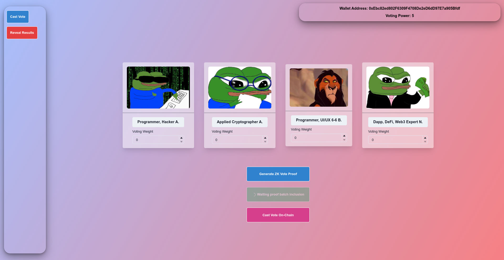

# agyso-zkdaovote

Privacy preserving DAO voting using **AlignedLayer** and PLONK proofs. In DAOs (Decentralized Autonomous Organizations), voting is the basic mechanism that enables the community to make decisions together. In these systems, each member generally votes in proportion to the amount of tokens he/she owns. All transactions can be viewed transparently in voting on the blockchain; It can be clearly tracked who has how much voting power and how they vote. Although this transparency provides advantages, it also eliminates user privacy. In current DAO voting systems, voting preferences are not hidden. Anyone can review the game via a user's wallet address, meaning private preferences are disclosed. This situation is worrying in matters where anonymity and personal privacy become important.


In this project, homomorphic encryption and zero-knowledge proof technologies are combined to protect users' privacy and ensure a fair voting process. Users cast encrypted votes using their voting power, which is determined by the amount of tokens they own. Thanks to homomorphic encryption during the voting process, these votes remain anonymous, but the total votes can be verified by the community. Zero-knowledge proofs verify that each user votes according to their voting power and does not cast negative votes. Thus, the reliability and integrity of the system is ensured while each individual's preferences remain confidential.

## Deployments

Network: Ethereum Holesky  
[AGYSO DAO Vote Validator Contract: 0x2DF98167F436d676B57614892Fb490D749b9c43b](https://holesky.etherscan.io/address/0x2df98167f436d676b57614892fb490d749b9c43b)

## Protocol

TL;DR A blockchain-based voting system designed to preserve voter privacy and ensure accurate vote weighting based on each participant’s token balance (vote power). The system achieves confidentiality by storing encrypted votes on-chain, leveraging homomorphic encryption for private vote aggregation, and using zero-knowledge proofs (ZKPs) for verification. 

### Homomorphic ElGamal Encryption
In Protocol, all ciphertexts proceed on ElGamal Homomorphic Encryption. First, the person who initiates the vote generates a private-public key pair and shares the public key. Voters then cast their votes using this public key. Votes are collected by homomorphic addition and decrypted when the voting process is finished. 
The ElGamal encryption implementation outside and inside the circuit is available in the  `zk/zk` folder. Reduced form of Twisted Edwards]of [BN254](https://iden3-docs.readthedocs.io/en/latest/_downloads/33717d75ab84e11313cc0d8a090b636f/Baby-Jubjub.pdf) was used as the elliptic curve.

Assume $(x, Y) = (x,\hspace{0.1in} x\cdot G)$ is a private-public key pair. The encryption and decryption as follows:

$$ Enc(m,Y) = (C_1, \hspace{0.1in} C_2) = (r \cdot  G, \hspace{0.1in} m \cdot G + r \cdot Y ) $$

$$ Dec(C_1,C_2, x ) = (C_2 - x \cdot C_1) = (m \cdot G)$$

After brute-force (or [using Shanks Algorithm](https://www.mat.uniroma2.it/~geatti/HCMC2023/Lecture4.pdf)) we can get message m. 

Let's say there is another encryption with $Y$

$$ Enc(m',Y) = (C'_1, \hspace{0.1in} C'_2) = (r' \cdot  G, \hspace{0.1in} m' \cdot G + r' \cdot Y ) $$

We can add these two encryptions.

$$ (C_1, \hspace{0.1in} C_2)+ (C'_1, \hspace{0.1in} C'_2) = [(r' + r) \cdot  G, \hspace{0.1in} (m'+m) \cdot G + (r' +r) \cdot Y ] $$


Then, by decrypting it, we obtain the sum of the two plaintexts $m' + m$.


### Zero-Knowledge Proof (ZKP)

Plonk on BN254 was used in the project. Since the protocol is based on encrypted votes, it must be proven that the encrypted votes are created properly. ZKP verify the following:

1. **Vote Power Validation**: ZKP confirms the encrypted votes accurately represents the voter’s token-based power (No more votes were given than token power) .
2. **Non-Negative Vote Check**: ZKP ensures no negative values are encrypted.
3. **Homomorphic Summation Correctness**: ZKP confirms that homomorphic encryption and summation were correctly applied, enabling accurate aggregation without revealing individual votes.

Gnark was used for proof generation and its circuit structure is as follows. (The number of ballots is fixed at 4.)

 ```
type CircuitMain struct {
	VoteWeight   frontend.Variable    `gnark:",public"` //
	MasterPubKey twistededwards.Point `gnark:",public"`
	Vote         [4]frontend.Variable
	Randoms      [4]frontend.Variable
	EncVoteOld   VotesCircuit `gnark:",public"`
	EncVoteNew   VotesCircuit `gnark:",public"`
}
 ```

* **VoteWeight** represents vote power.
* **MasterPubKey** represents encryption public key.
* **Vote** 
represents votes.
* **Randoms** represents randoms used in encryption.
* **EncVoteOld**  represents the encrypted votes to be exchanged in the chain.
* **EncVoteNew**  represents new encrypted votes added to EncVoteOld.

## Running agyso-daovote

Tested with Debian 11, Ubuntu 22, go1.23, rust 1.82.0.

0. Clone repository `git clone --recursive https://github.com/mrkaurelius/agyso-zkdaovote`
1. Copy `./agyso-zkdaovote/vault` dir to `/var/tmp/agyso-daovote/vault`
2. Build `sdk/daovote-rs` and add generated binary to shell PATH
3. Initialise circuit and protocol with `cd ./zk && make cli`
4. Start `daovote-zk-service` service with `cd ./zk && make service` which generates proof and submit proofs to aligned layer
5. Start dapp frontend with `cd ./app && npm run dev`
6. profit :)

## Directories

### zk

Go codebase for zk. 

`zk/cmd/zkdaovote-cli` handles zkdaovote protocol initialisation which includes circuit and key generation.  

`zk/cmd/zkdaovote-service` serves an HTTP service for performing generation and proof submition to aligned layer. It
uses `daovote-rs` for aligned network operaitons.

### sdk

`daovote-rs` uses aligned-sdk for submitting proofs to aligned layer. It's also generates calldata for `app` to use.

Used aligned_layer verison: `v0.9.2`.

### smartcontract

An Hardhat project which inludes `AGYSODaoVoteValidator.sol` contract. Our contract verifies vote proof and set state
accordingly.

### app

Fronted app for zkdaovote. Developed with react, vite chakra-ui.




## Arhictecture Diagram

TODO

## Team

### Kumru A.

Programmer.  [Github](https://github.com/mrkaurelius),  [Blog](https://kumru.dev).


### Dogan A.
Applied Cryptographer. [Scholar](https://scholar.google.com/citations?user=p97l-EEAAAAJ&hl=tr), [Github](https://github.com/midmotor)


### 

## Project Roadmap

1. Protocol robustness and decentralisation.
    1. TODO 
2. Web native decentralized applicaiton deployment.
   1. Deploying protocol and app in one web app (dapp).
   2. Proof creation on browser.
3. Testnet deployment 
4. Splitting the private key, which will end the voting and decrypt the encrypted votes, using secret sharing and threshold decryption.